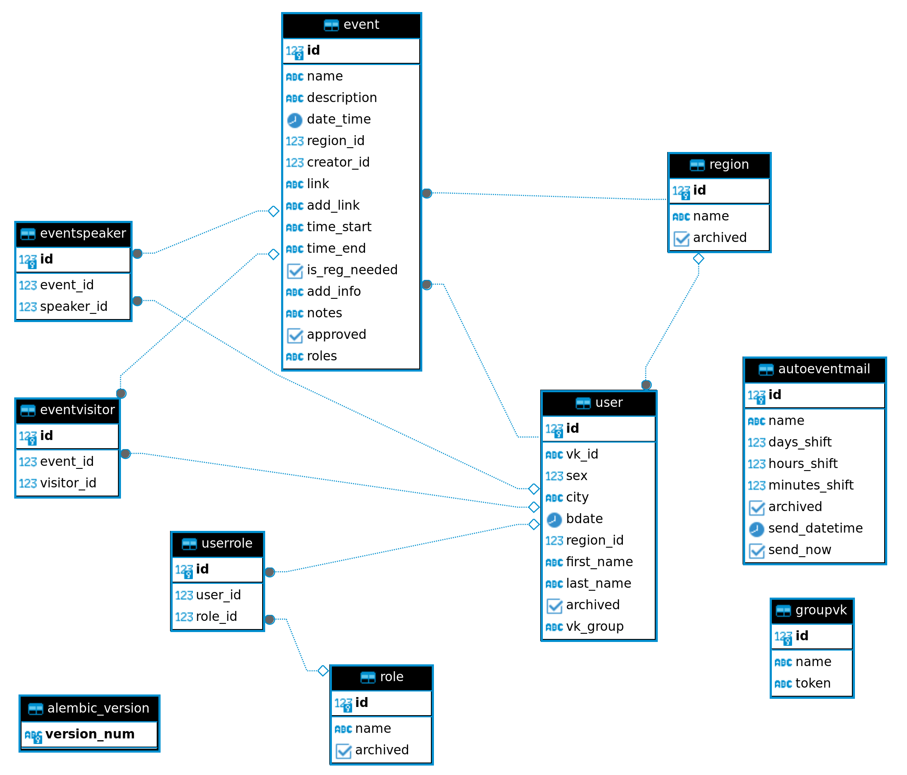
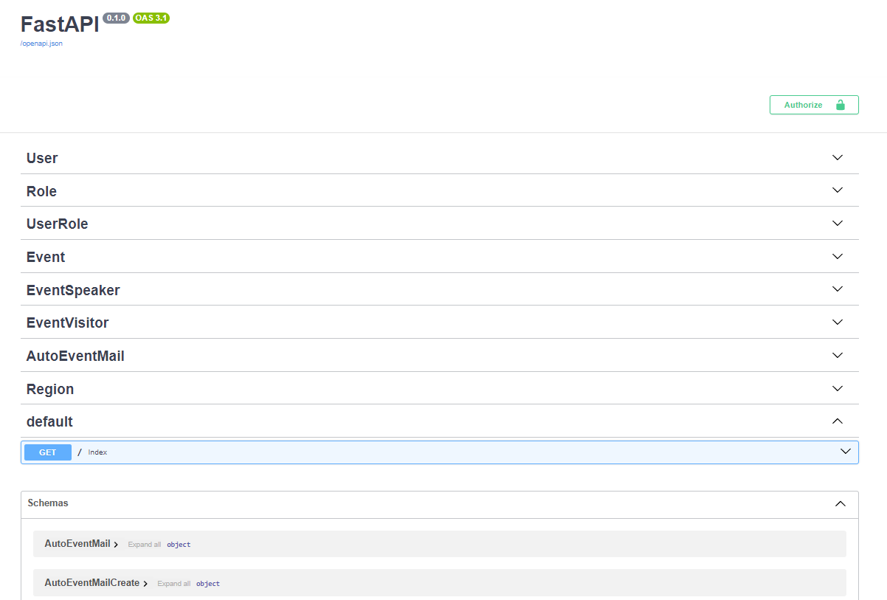

## Backend API для сервиса CampWeek

### Стек: `Fastapi`, `PostgreSQL`, `SQLAlchemy`, `Alembic`.

### Схема БД:

### Основная функциональность сервиса:
- Регистрация юзера через ВК
- Личный кабинет юзера (данные подтягивается из ВК) с возможностью изменения в нём информации
- Кабинет администратора
- Создание событий и их получение по разнообразным фильтрам
- Автоматическая рассылка для групп в ВК
- CRUD для ролей
- CRUD для регионов
* Интерактивная документация: http://109.201.65.62:5777/docs

### Инструкции по запуску:
1. `cd <Абсолютный путь к директории CampWeek_backend>`
2.  `docker compose -f docker-compose.dev.yml run --name campweek_backend_api --service-ports -d app`
3. Data migration command `bash data_migration.th`
* Полезные команды находятся в `instructions/docker.txt`

### Важные моменты:
Если при сборке образа будет ошибка, то попробуйте удалить "�" в конце `requirements.txt`
